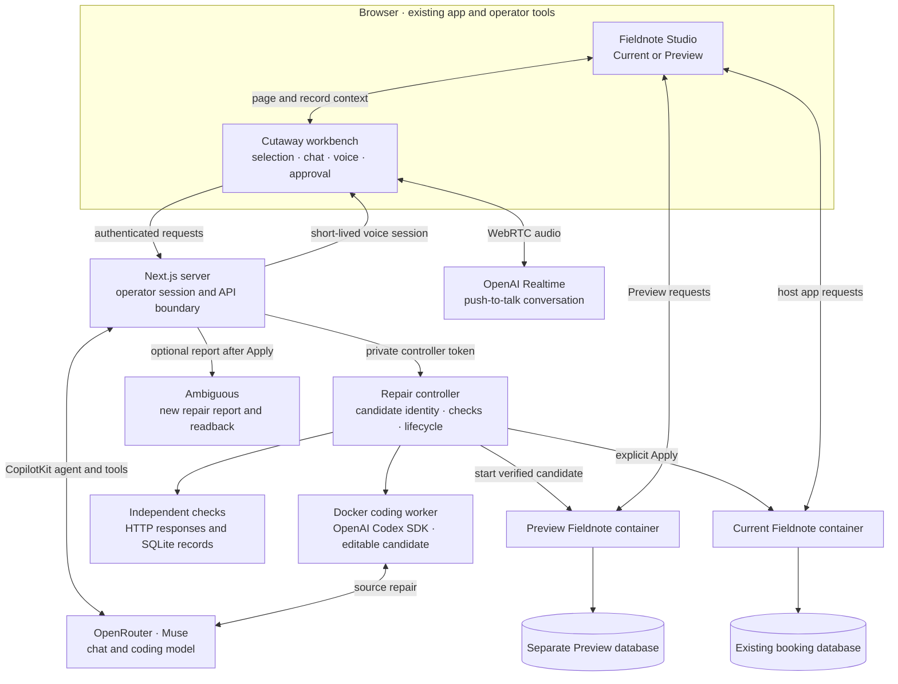
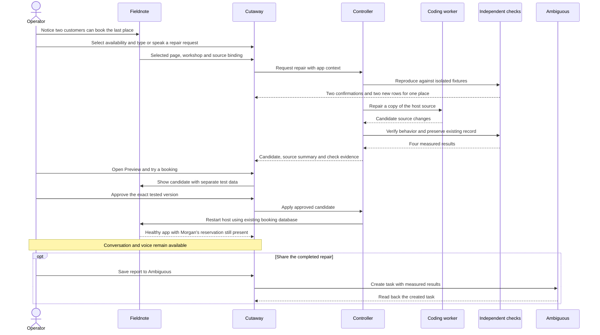

# Cutaway architecture

Cutaway puts an operator's coding agent beside the app they are using. The host
supplies the selected page and record; Cutaway carries that context through
investigation, source repair, independent checks, Preview and an approved update.
Fieldnote Studio is the first working host integration.

[Run it](README.md#run-the-demo) · [Watch the workflow](DEMO.md) ·
[Implementation design](Cutaway-OpenSpec/openspec/changes/build-cutaway-in-app-repair/design.md)

## Components

The browser keeps the conversation and voice session mounted while the host app
restarts. The local controller owns the repair lifecycle and the evidence used to
enable Apply. Model-generated source is a candidate until it passes those checks
and the operator approves that exact version.

The checks run the candidate in their own disposable containers and use their
own fixtures. They inspect the database directly after the target stops. Preview
has separate data again, so the operator can make a test booking without changing
the active app's reservations.

## From discovery to a verified update

The operator starts inside Fieldnote. Ambiguous receives the completed result
after the repair; it supplies no prerequisite ticket or bug report.

If the checks fail, Apply stays unavailable. A successful check binds the source
and build identity to the candidate under review; approval of one version does
not authorize a different version. Applying restarts only the host target, keeping
the Cutaway shell and existing booking database in place.

## Who can do what

| Boundary                     | Enforced behavior                                                                                                                                                                                          |
| ---------------------------- | ---------------------------------------------------------------------------------------------------------------------------------------------------------------------------------------------------------- |
| Visitor and operator         | Visitors use Fieldnote normally. Staff sign in at `/operator`; signed, expiring HttpOnly sessions protect the AI, repair, voice and workplace APIs. The launcher alone is not the access check.            |
| Browser and providers        | Long-lived API keys stay server-side. Browser voice uses a short-lived Realtime session.                                                                                                                   |
| Coding worker and controller | The worker edits an allowed subset of candidate source in Docker. It cannot approve or Apply, edit the independent checks, or access the active database, controller credentials or Ambiguous credentials. |
| Candidate and active app     | Reproduction, independent verification and interactive Preview use separate test data. Apply retains the existing active database.                                                                         |
| Repair and team handoff      | The operator chooses Save report after Apply. The server sends the verified result to Ambiguous and reads back the created task before reporting success.                                                  |

The demo uses a shared staff password. A host integrating Cutaway should connect
the authorization boundary to its own operator identity and permissions.

## Integrating another app

Cutaway's reusable pieces are the workbench, conversation and voice controls,
repair lifecycle, isolated coding worker and approval flow. Each host connects
the following pieces, using Fieldnote as the working example:

| Host responsibility                                             | Fieldnote implementation                                                                                                                   |
| --------------------------------------------------------------- | ------------------------------------------------------------------------------------------------------------------------------------------ |
| Identify the selected page, record and relevant source          | [Browser connector](examples/fieldnote/src/client/connector.ts) and [shared context types](packages/cutaway-core/src/index.ts)             |
| Decide which source the worker may edit                         | [Workspace and source validation](apps/controller/src/workspace.ts)                                                                        |
| Reproduce the problem and verify useful behavior independently  | [HTTP and SQLite checks](packages/cutaway-checks/README.md)                                                                                |
| Build and run Current and Preview; restart the approved version | [Target processes](apps/controller/src/processes.ts) and [repair controller](apps/controller/src/controller.ts)                            |
| Authorize operators and connect team workflows                  | [Session boundary](apps/web/src/lib/server/cutaway/operator-auth.ts) and [Ambiguous adapter](apps/web/src/lib/server/cutaway/workorder.ts) |

The current web integration exchanges context through `postMessage`. Another
host supplies its own context, checks and lifecycle behavior; Fieldnote's booking
rules belong to that adapter. The repository demonstrates one complete integration
and provides the source for extending the same repair flow to another app.

Ambiguous carries the repair evidence into wider team work. The saved task can
support a manager's review, a booking check or a customer update through connected
workflows. This demo verifies task creation and readback; those downstream actions
are determined by the team's Ambiguous integrations.

## Code map and development scope

| Location                                                     | Responsibility                                                                           |
| ------------------------------------------------------------ | ---------------------------------------------------------------------------------------- |
| [apps/web](apps/web/README.md)                               | Next.js shell, CopilotKit tools, voice, operator access, approval UI and provider routes |
| [apps/controller/src](apps/controller/src)                   | Repair state, source identity, worker execution, checks and target lifecycle             |
| [infra/codex-worker](infra/codex-worker/README.md)           | Docker image and Codex SDK worker entrypoint                                             |
| [packages/cutaway-core/src](packages/cutaway-core/src)       | Shared typed context, state and action contracts                                         |
| [packages/cutaway-checks](packages/cutaway-checks/README.md) | Independent booking fixtures and behavioral checks                                       |
| [examples/fieldnote](examples/fieldnote/README.md)           | React/Vite host, booking API, SQLite storage and context connector                       |

The hackathon build handles one local host and repair at a time. Its checked-in
Fieldnote source deliberately retains the booking bug; runtime repairs operate on
copies. Generated candidates, databases and credentials are ignored by Git.
The [worker notes](infra/codex-worker/README.md) describe the Docker sandbox and
its local compatibility adjustment. Hosting, migrations and automatic rollback
are outside this demonstration's scope.

See [CONTRIBUTING.md](CONTRIBUTING.md) for the verification command and
[the recorded evidence](assets/cutaway-run.json) for the demonstrated outcome.
