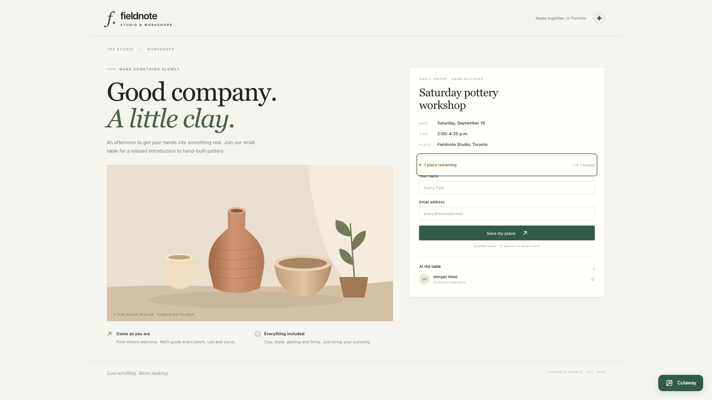

# Cutaway

**Fix the app without leaving it.**

Cutaway is an embeddable repair assistant for applications you control. Fieldnote
Studio is the first demo integration. Its branding and normal workflow remain
primary; Cutaway opens from a small in-app launcher.

An operator notices a bug while using the app, opens Cutaway, and asks for a
repair. Try the change in Preview, then approve it for the live app while keeping
existing reservations. Afterward, optionally share the verified result with the
team by creating a report in Ambiguous.

[Watch the 1:48 demo](assets/cutaway-demo.mp4) · [Demo walkthrough](DEMO.md) ·
[Recorded run evidence](assets/cutaway-run.json)



## Run the demo

Node **22** and Docker are required. Use the checked-in `.nvmrc`; on the prepared
Mac, `export PATH="/opt/homebrew/opt/node@22/bin:$PATH"` selects the installed version.

```bash
npm ci
cp .env.example .env
# Configure the provider keys and an operator password described below.
docker build -f infra/codex-worker/Dockerfile -t cutaway-codex-worker infra/codex-worker
npm run dev:cutaway
```

Open **http://127.0.0.1:3100** for the customer view. Staff sign in at
**http://127.0.0.1:3100/operator** to use Cutaway in the same Fieldnote app.
Existing setups should preserve their `.env` instead of copying over it. Keys
stay server-side and out of Git:

| Setting                                                 | Use                                                                          |
| ------------------------------------------------------- | ---------------------------------------------------------------------------- |
| `OPENROUTER_API_KEY`                                    | Chat and the isolated coding worker                                          |
| `MODEL`, `CODEX_MODEL`                                  | Defaults: `meta/muse-spark-1.3-contributor`                                  |
| `OPENROUTER_REASONING_EFFORT`, `CODEX_REASONING_EFFORT` | `xhigh`; the selected model's `max` tier requires additional provider access |
| `OPENAI_API_KEY`                                        | OpenAI Realtime voice; typing works independently                            |
| `AMBIGUOUS_API_KEY`                                     | Optional: share the completed repair with a workspace you control            |
| `CUTAWAY_OPERATOR_PASSWORD`                             | Required: staff access to Cutaway; choose a private password                 |

## Try the workflow

1. Sign in as an operator, open Cutaway, and select Fieldnote's availability indicator.
2. Ask it to reproduce the last-place double booking, repair it and preserve existing bookings. Type or connect voice and hold to talk.
3. Inspect the real experiment, source change summary and independent checks.
4. Try the candidate using **Preview**. Its bookings use a separate test database.
5. Review and explicitly approve **Apply**. Only Fieldnote restarts; Morgan's existing reservation remains.
6. Optionally choose **Save report to Ambiguous**. A task is created with the measured result, and the receipt appears after actual readback.

`npm run demo:reset` restores the synthetic defective baseline and creates a fresh
runtime context after work has settled. It resets demo data; Apply preserves data.
Stop the dev command with Ctrl+C to stop its owned services.

## Check the code

```bash
npm run verify:cutaway
```

This runs strict workspace types, tests, lint and production builds. Independent
booking checks use real HTTP requests and inspect SQLite directly: two customers
for one place, three for three places, full-capacity rejection and exact preservation
of the existing record. A frontend-only or reject-all workaround cannot pass.

## How it works

The Next.js/CopilotKit shell holds context, conversation and voice. A small local
controller starts a fresh Codex SDK worker in Docker with only candidate source
mounted for editing. The controller owns checks, preview data, the verified source
identity and target restart. The worker cannot Apply or access the active database,
provider work-order credentials, this implementation spec or protected checks.

- [Fieldnote source and endpoints](examples/fieldnote/README.md)
- [Independent checks](packages/cutaway-checks/README.md)
- [Design and limits](Cutaway-OpenSpec/openspec/changes/build-cutaway-in-app-repair/design.md)
- [Demo script](Cutaway-OpenSpec/openspec/changes/build-cutaway-in-app-repair/demo-script.md)
- [Implementation progress](Cutaway-OpenSpec/openspec/changes/build-cutaway-in-app-repair/tasks.md)

## Integrate another app

Supply the host app's source, page/record context, independent behavior checks,
and build/start/restart adapter. The current integration is a web app using a
small postMessage connector; it can be adapted to other web frameworks. Cutaway's
shell, conversation, coding worker and approval flow are the reusable layer.
Fieldnote-specific booking fixtures/checks are the sample adapter, not a claim that
all apps are booking apps. Other applications need their own integration and checks;
this repository currently demonstrates one host end to end.

Use the host app's authentication and operator permissions to decide who can
access Cutaway. This demo uses a shared staff password and signed, expiring
HttpOnly sessions. The server checks the session on every AI and repair API;
hiding the launcher alone is not the access control. Visitors can book workshops
without receiving the Cutaway workbench or its model provider.

## Demo scope and limitations

One local app and repair at a time. Fieldnote deliberately contains a real booking
race and synthetic records/provider delay. The runtime fixes source; there is no
prewritten patch or fixed-mode switch. Preview data is separate from active data.
There is no hosting, migration, automatic rollback or production-readiness claim.
A failed check prevents Apply; a failed external report remains labelled unsaved.

Docker Desktop requires a documented seccomp compatibility adjustment for Codex's
nested workspace sandbox. The container still drops capabilities, uses a read-only
image and restricted mounts, and the SDK keeps workspace/network confinement.
This is a controlled local demo, not a hostile-code hosting service.

## Attribution

Built on CopilotKit's MIT-licensed Agents, Everywhere starter at
`86f547d74e8bd32e047226b0e1fb862cca02a5c7`. Inherited pieces include the web runtime,
page-context/tool integration, model adapter, voice SDK connection and approved
workplace adapter. Cutaway adds the Fieldnote app, repair controller/worker,
independent booking checks, preview/apply workflow and repair-report handoff.
The original [LICENSE](LICENSE) is preserved. Source implementation and runtime
repairs are AI-assisted. Event-build history must reflect actual commits and work.

<details>
<summary>Inherited starter documentation and sponsor setup</summary>

<div align="center">

# Agents, Everywhere Hackathon Starter Kit


**Build an agent that belongs where people already work, talk, and live.**

[Overview](#overview) · [Get started](#get-started) · [Templates](#templates) · [Coding agent](#coding-agent) · [Resources](#resources)

</div>

## Overview

Build for **[Agents, Everywhere: Bots, Channels, & More](https://aitinkerers.org/hackathons/global/agents-everywhere)**, the AI Tinkerers global hackathon on **September 12–13, 2026**. Choose your city on the event page for its local schedule. Put an agent inside a conversation, an app, a phone, or a physical environment. Make the context of that place essential to what it can do.

This kit gives you three runnable templates, files to hand to your coding agent, and sponsor setup notes. Pick a user, a problem, and one complete interaction. You can use any stack; you do not need every sponsor or every surface.

Your project and its core functionality must be created during the event. Existing libraries, templates, and starter code are allowed; describe what you reuse and what you build. Read [the rules](hackathon-rules.md), then follow your city's participant portal for the current deadline and judging criteria.

## Get started

Use Node.js 22+, then clone and install the kit:

```bash
git clone https://github.com/CopilotKit/agents-everywhere-starter-kit.git
cd agents-everywhere-starter-kit
npm ci
cp .env.example .env
```

Choose one template and configure only the credentials it needs. Slack and web use the root install; React Native has its own install under `apps/mobile` because Expo pins its React Native stack separately.

Paste this into your coding agent:

```text
Read AGENTS.md, hackathon-overview.md, hackathon-rules.md, and
using-sponsor-tools.md. Help me choose one template app README for my idea,
then adapt this checkout into our own project. Ask me who it is for and
what the agent should do in that setting. Follow this README's CopilotKit
onboarding section for the selected app; keep its existing infrastructure.
Use only the integrations the idea needs. Verify a complete interaction and
prepare SUBMISSION.md, distinguishing inherited code from our event work.
```

### CopilotKit onboarding

Use the team's maintained setup prompts in the same coding-agent session, with this checkout as the project root. Choose one app first; setup should adapt that app rather than scaffold a second starter over it.

| Your starting point          | Onboarding path                                                                                                                                                                                                                                                                                                             |
| ---------------------------- | --------------------------------------------------------------------------------------------------------------------------------------------------------------------------------------------------------------------------------------------------------------------------------------------------------------------------- |
| Slack template               | Run `npm run channel:setup -- --no-clipboard`, then have your agent follow the prompt it prints. This installs the current `channels-setup` skill; the command itself does not create a Channel or sign you in. Tell the agent to connect **Slack** using `apps/channel` and read its bundled `build-channels-agent` skill. |
| Web or React Native template | The existing model-provider setup runs without Intelligence. To add managed conversations with Rich Threads and other Intelligence capabilities, use the prompt below for the chosen app.                                                                                                                                   |

**Connect the selected app to CopilotKit Intelligence:**

```text
Read AGENTS.md and the selected app README. Connect that app to CopilotKit
Intelligence using the current official onboarding workflow. This checkout
already has CopilotKit: preserve the existing app, agent, model provider,
tools, and approval behavior. For apps/mobile, keep Expo and the separate
mobile install; its runtime is served by apps/web.
Generate a fresh 12-character hexadecimal run ID, substitute it for RUN_ID,
then run from the repository root:
npx --yes copilotkit@latest onboard start --run RUN_ID
Follow the instructions returned by the CLI and reuse that ID for this run.
Show the integration plan before editing, and prove the selected app works
before and after connecting Intelligence.
```

The [official CopilotKit prompt](https://docs.copilotkit.ai/llms.txt) serves new projects, existing apps, and existing CopilotKit integrations. The [docs home](https://docs.copilotkit.ai/) also offers **Copy Prompt**, **Open in Codex**, and **Open in Claude Code**; add the selected template's context when using those entry points. For Slack, use the [Channels onboarding path](https://docs.copilotkit.ai/slack) above. Finish one selected workflow before starting another.

Follow the CLI's returned instructions for sign-in, project selection, credentials, and verification. Keep credentials out of chat and preserve existing `.env` values. The starter reads `INTELLIGENCE_API_KEY`; if setup provisions `CPK_INTELLIGENCE_API_KEY`, map it to the variable the selected runtime actually reads. Review any required package upgrades together with the tested Channels/runtime pair and `@ag-ui/client` override. Intelligence onboarding changes the app; installing a skill or adding an API key alone does not complete that integration.

## Templates

These starting points serve different kinds of context. **CopilotKit Channels** brings the Slack agent into the conversation; **CopilotKit React** connects the web agent to the app people are using; **CopilotKit React Native** brings the same agent pattern onto a phone.

### 1. Slack — an agent that joins the thread

**OpenAI + CopilotKit Channels + Exa**

An agent reads what people already said, researches with Exa, and answers in the same thread with native cards and source links. Start with a support conversation, a research discussion, or a team decision.

The included Slack app supplies thread history, subscriptions, search, and Channels UI. Configure your model, Exa, and a managed Channel, then run `npm run dev:slack`. No public tunnel is needed. Teams or other chat platforms can use the same Channels pattern, but this starter ships the Slack app.

**[Use the Slack template →](apps/channel/)**

### 2. Web — an agent inside your app

**OpenAI + CopilotKit React + Ambiguous AI**

An agent sees the page you are on and turns a request into a real workplace record you can still find after a refresh. Adapt it to customer follow-ups, a project workspace, or a personal planning app.

The included web app supplies page context, frontend tools, agent-rendered UI, and a browser approval step. Connect an Ambiguous AI workspace, then run `npm run dev:web`; approved follow-ups are saved through the server and can be read back after refresh.

**[Use the web template →](apps/web/)**

### 3. React Native — an agent in your pocket

**OpenAI or OpenRouter + CopilotKit React Native**

A mobile agent reads app state, renders native cards, and waits for a tap before changing local sample data. Start with a personal finance assistant, a field checklist, an inventory counter, or any workflow where phone context and approval matter.

The included Expo app supplies seeded finance state, native rendered tool UI, a human-in-the-loop expense approval, and a mobile-specific CopilotKit runtime endpoint served by the web app. Configure your model provider, start `npm run dev:web`, then run the mobile app from `apps/mobile`.

**[Use the React Native template →](apps/mobile/)**

### Make the demo yours

The supplied on-call and finance assistants are **infrastructure examples**: read ambient context, call a tool, render useful UI, and return a verifiable result. Choose a different user, problem, dataset, and interaction; the goal is your own project, not another version of the starter scenario.

Use the [demo prompts](dev-docs/demo-prompts.md) to learn how the pieces connect, then replace the sample domain. In the Slack sample incident flow, approval cards record decisions without executing production actions. In the web follow-up flow, the page approval button saves the reviewed Ambiguous task. In the mobile finance flow, approval changes local in-memory sample data. Enforce the same kind of write boundary around any external action you add.

Want another surface pattern? The web app also includes a voice route, and the shared agent can connect to remote MCP tools when configured. The event surfaces are inspiration, not separate tracks or a requirement to build multiple apps.

## Coding agent

Give your agent these files before it starts coding:

| File                                                           | What it provides                                                                                    |
| -------------------------------------------------------------- | --------------------------------------------------------------------------------------------------- |
| [hackathon-overview.md](hackathon-overview.md)                 | The challenge, four surfaces, and official judging criteria                                         |
| [hackathon-rules.md](hackathon-rules.md)                       | Build eligibility, inherited code, and required deliverables                                        |
| [using-sponsor-tools.md](using-sponsor-tools.md)               | Every sponsor featured in this kit: access, authentication, configuration, and a first working call |
| [AGENTS.md](AGENTS.md)                                         | Repository conventions and verification commands                                                    |
| [Channels skill](.agents/skills/build-channels-agent/SKILL.md) | Verified Channels APIs for the Slack template                                                       |

The app READMEs provide launch commands, files to customize, and a concrete result to check. Start with one template and add a second surface only if it helps your user.

## Resources

| Need                                 | Go here                                                                                                                                                                                                    |
| ------------------------------------ | ---------------------------------------------------------------------------------------------------------------------------------------------------------------------------------------------------------- |
| Event details, deadline, and judging | [Find your city](https://aitinkerers.org/hackathons/global/agents-everywhere), then open its participant portal and handbook                                                                               |
| OpenAI agent development             | [Agents SDK quickstart](https://openai.github.io/openai-agents-js/guides/quickstart/)                                                                                                                      |
| OpenRouter access and model choice   | [Quickstart](https://openrouter.ai/docs/quickstart) · [Keys](https://openrouter.ai/keys) · [Model catalog](https://openrouter.ai/models) · [Model switching](dev-docs/model-switching.md)                  |
| CopilotKit app development           | [Docs](https://docs.copilotkit.ai/) · [Tools and context](dev-docs/tools-and-context.md) · [Discord channel for technical questions](https://discord.com/channels/1122926057641742418/1548038338848489532) |
| CopilotKit Channels                  | [Channels guide](https://copilotkit.ai/channels-guide.md) · [Screenshot walkthrough](dev-docs/channels-sdk-walkthrough/README.md) · [OpenTag example app](https://github.com/CopilotKit/OpenTag)           |
| Exa quickstart                       | [Search API guide](https://exa.ai/docs/reference/search-api-guide) · [Kit setup](using-sponsor-tools.md#exa)                                                                                               |
| Auth0 API authorization              | [Node API](https://auth0.com/docs/quickstart/backend/nodejs) · [Kit setup](using-sponsor-tools.md#auth0)                                                                                                   |
| Ambiguous AI quickstart              | [Developer guide](https://www.ambiguous.ai/llms.txt) · [Kit setup](using-sponsor-tools.md#ambiguous-ai)                                                                                                    |
| Rehearse and debug                   | [Demo prompts](dev-docs/demo-prompts.md) · [Troubleshooting](dev-docs/troubleshooting.md)                                                                                                                  |
| Prepare your entry                   | [Submission checklist](SUBMISSION.md)                                                                                                                                                                      |

For credit redemption instructions, choose your city on the [global event page](https://aitinkerers.org/hackathons/global/agents-everywhere) and check its participant portal's **Credits & Offers** section.

For technical questions during the event, check your city's participant portal and ask your local organizers.

For the Slack/web workspaces, `npm run verify` runs typechecks and offline tests without credentials. The mobile app has its own install, tests, typecheck, and Metro export checks under `apps/mobile`. Each app reports missing configuration when the relevant integration is used. Live sponsor calls and platform delivery require your accounts. See [developer docs](dev-docs/README.md) for detailed setup and deployment.

</details>
